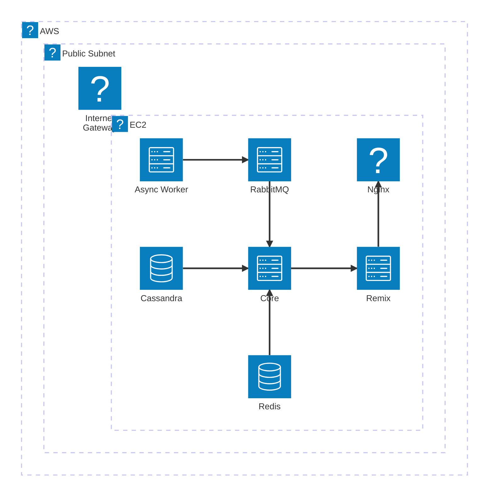

# Exercise Analyser

Check out the doc for architecture and design details.

---

## Cloud Architecture

```mermaid
architecture-beta
  group aws(logos:aws)[AWS]

  group ps(logos:aws-vpc)[Public Subnet] in aws

  service ig(logos:aws-api-gateway)[Internet Gateway] in ps

  group ec2(logos:aws-ec2)[EC2] in ps

  service db(database)[Cassandra] in ec2
  service redis(database)[Redis] in ec2
  service proxy(logos:nginx)[Nginx] in ec2
  service backend(server)[Core] in ec2
  service frontend(server)[Remix] in ec2
  service mq(server)[RabbitMQ] in ec2
  service worker(server)[Async Worker] in ec2

  db:R --> L:backend
  redis:T --> B:backend
  frontend:L <-- R:backend
  frontend:T --> B:proxy
  backend:T <-- B:mq
  worker:R --> L:mq
```