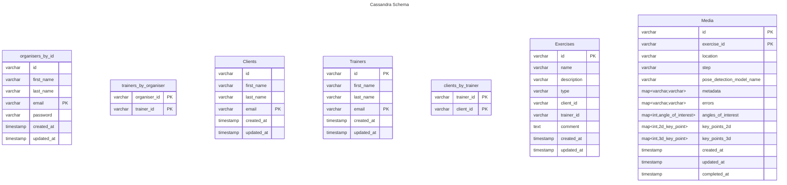

# Cassandra

- Where query without full primary key is an inefficient cluster search, always use full primary key
- Using mix strategy of data normalisation and denormalisation
  - Media table will be denormalised as it's a bigger table in terms of data size
  - Others will be normalised

# Application Query

1. Organiser
   1. Get organiser
   2. Create organiser
2. Client
   1. Get list of clients
      1. Filter by client id, client email, trainer id, trainer email
      2. ```cql
         SELECT * FROM clients WHERE id = 'client_id' AND email = 'client_email' AND trainer_ids CONTAINS 'trainer_id' AND trainer_ids CONTAINS 'trainer_email';
         ```
   2. Create Client
   3. Update Client
      1. where client id
      2. 
   4. Delete Client
3. Trainer
   1. Get list of trainers
   2. Create Trainer
   3. Update Trainer
   4. Delete Trainer
4. Exercise
   1. Get list of exercises
      1. Filter by date range, client id, type
      2. Plot the key points over time
      3. ```cql
         SELECT * FROM exercises WHERE created_at >= 'start_date' AND created_at <= 'end_date' AND client_id = 'client_id' AND type = 'type' AND step = 'step';
         ```
   2. Create Exercise
   3. Update Exercise
      1. Change comment or train id
      2. where exercise id
      3. ```cql
         UPDATE exercises SET comment = 'comment', trainer_id = 'trainer_id' WHERE id = 'exercise_id';
         ```
   <!-- 4. Delete Exercise
      4. where exercise id
      5. ```cql
         DELETE FROM exercises WHERE id = 'exercise_id';
         ``` -->
5. Media
   1. Get media by exercise id
      1. where exercise id
   2. Create Media
      1. On exercise video creation
   3. Update Media
      1. Allow to update metadata, errors, angles of interest, key points 2d, key points 3d, updated at, completed at
      2. Where id

---

